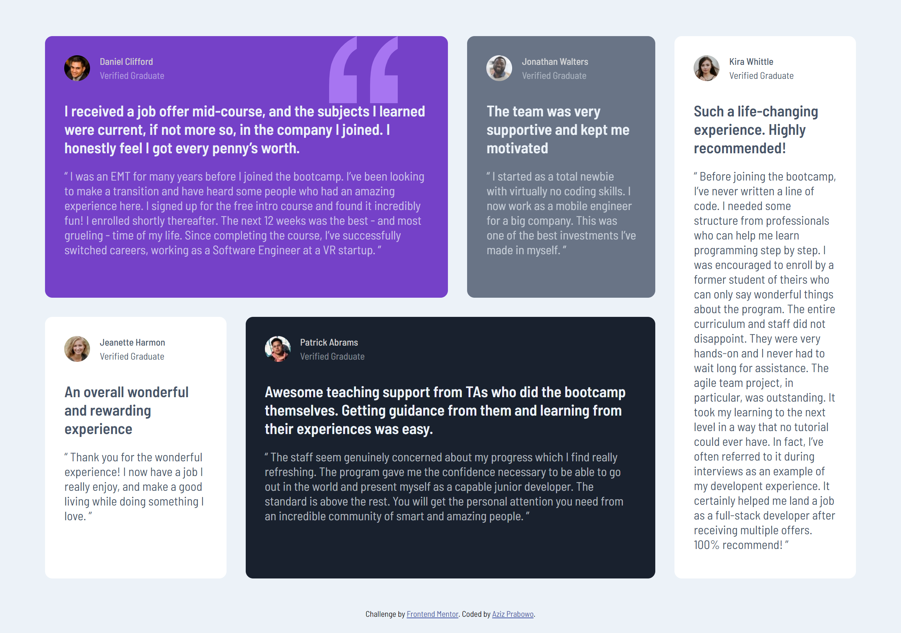

# Frontend Mentor - Testimonials grid section solution

This is a solution to the [Testimonials grid section challenge on Frontend Mentor](https://www.frontendmentor.io/challenges/testimonials-grid-section-Nnw6J7Un7). Frontend Mentor challenges help you improve your coding skills by building realistic projects.

## Table of contents

- [Overview](#overview)
  - [The challenge](#the-challenge)
  - [Screenshot](#screenshot)
  - [Links](#links)
- [My process](#my-process)
  - [Built with](#built-with)
  - [What I learned](#what-i-learned)
- [Author](#author)

## Overview

### The challenge

Users should be able to:

- View the optimal layout for the site depending on their device's screen size


### Screenshot



### Links

- Solution URL: [SOLUTION]()
- Live Site URL: [LIVE SITE]()

## My process

### Built with

- Semantic HTML5 markup
- CSS custom properties
- Flexbox
- CSS Grid
- Mobile-first workflow

### What I learned

I deep down more on CSS Grid properties in this challenge. I learned how to add gap, remove items space in CSS Grid, and positioning background image.

To see how you can add code snippets, see below:

```css
main {
  display: grid;
  grid-template-columns: 21% 23.5% 21.8% 21%;
  grid-template-rows: 47% 47%;
  gap: 2em;
  place-content: center;
}

main .card-1 {
  grid-row-start: 1;
  grid-row-end: 2;
  grid-column-start: 1;
  grid-column-end: 3;
  margin: 0;
}

main .card-1 {
  background-color: var(--clr-dani-primary-violet);
  background-image: url(images/bg-pattern-quotation.svg);
  background-repeat: no-repeat;
  background-position: 85% 0;
  background-size: 17%;
}
```

## Author

- Frontend Mentor - [@azizp128](https://www.frontendmentor.io/profile/azizp128)
- Twitter - [@azizprbw](https://www.twitter.com/azizprbw)
